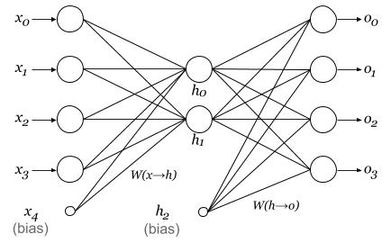

# libTinyMLP

## Introduction

This project implemented the single hidden layer perceptron and its back propagation training algorithm. It can be used as a toy for tinkering with simple neural networks. This library can potentially be ported onto embedded processors, to help to solve simple pattern recognition problems.

## Demonstration Program



The demonstration program constructed a 4-2-4 autoencoder, trained it with an example data set and finally displayed the testing results. You should see it automatically finds an encoding scheme of the four input patterns.

To try out the demonstration:

```
$ make
$ ./demo
```

As the program uses only the basic gradient descent algorithm, it may be trapped in a local optimal solution. If the error function still does not converge to the target value after a certain number of epochs, it will automatically start from another random point in the error space.
